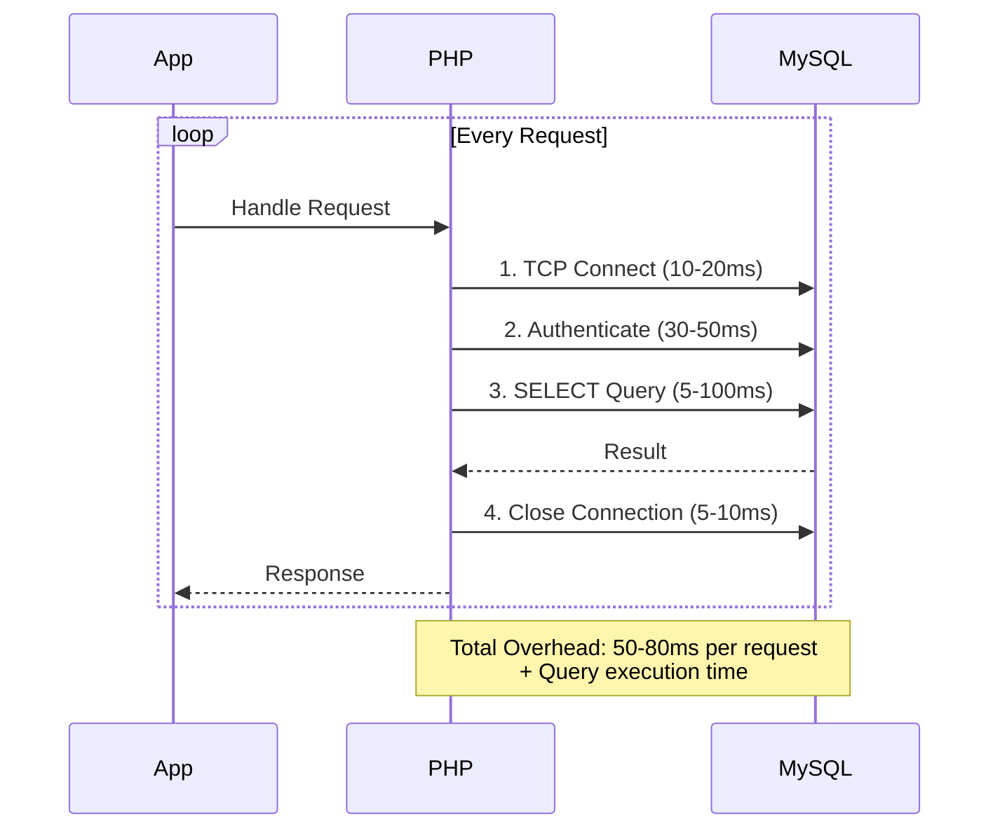
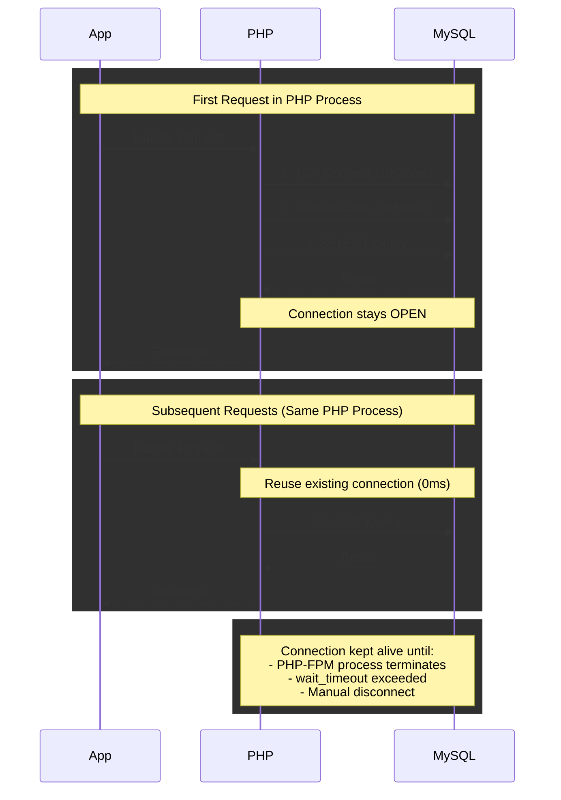
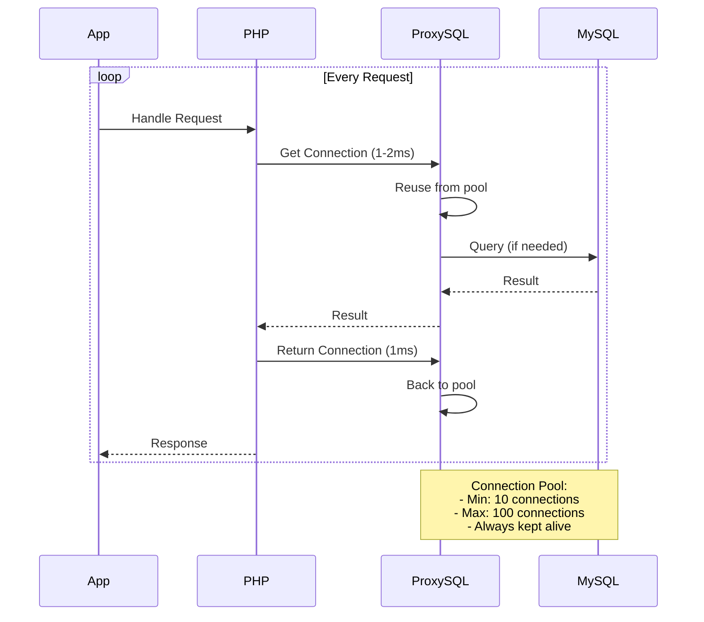

# Database Connection Pooling - Analysis & Implementation

## Apa itu Database Pooling?

Database pooling adalah teknik untuk **me-reuse koneksi database** yang sudah ada, daripada membuat koneksi baru setiap kali request datang.

### Tanpa Database Pooling (Current):

```
Request 1 → Open Connection → Query → Close Connection
Request 2 → Open Connection → Query → Close Connection
Request 3 → Open Connection → Query → Close Connection
```

❌ **Overhead tinggi**: membuat koneksi baru setiap kali (~50-100ms per koneksi)

### Dengan Database Pooling:

```
Request 1 → Get Connection from Pool → Query → Return to Pool
Request 2 → Get Connection from Pool → Query → Return to Pool
Request 3 → Get Connection from Pool → Query → Return to Pool
```

✅ **Overhead rendah**: reuse koneksi yang sudah ada (~1-5ms)

---

## Cara Menerapkan Database Pooling di CodeIgniter 4

### Option 1: Persistent Connection (pConnect) - **RECOMMENDED untuk PHP-FPM**

Ini adalah cara paling mudah untuk database pooling di PHP.

#### Langkah 1: Edit `app/Config/Database.php`

```php
public array $default = [
    'DSN'          => '',
    'hostname'     => 'localhost',
    'username'     => '',
    'password'     => '',
    'database'     => '',
    'DBDriver'     => 'MySQLi',
    'DBPrefix'     => '',
    'pConnect'     => true,  // ✅ UBAH dari false ke true
    'DBDebug'      => true,
    'charset'      => 'utf8mb4',
    'DBCollat'     => 'utf8mb4_unicode_ci',
    'swapPre'      => '',
    'encrypt'      => false,
    'compress'     => false,
    'strictOn'     => false,
    'failover'     => [],
    'port'         => 3306,
    'numberNative' => false,
];
```

#### Langkah 2: Konfigurasi MySQL untuk Connection Pooling

Edit file MySQL config (`/etc/my.cnf` atau `/etc/mysql/my.cnf`):

```ini
[mysqld]
# Connection Pool Settings
max_connections = 200           # Total maksimum koneksi
max_user_connections = 150      # Per user
wait_timeout = 300              # 5 menit (detik)
interactive_timeout = 300       # 5 menit (detik)

# Connection Performance
thread_cache_size = 50          # Cache thread untuk koneksi
connect_timeout = 10            # Timeout saat connect
```

Restart MySQL:

```bash
sudo systemctl restart mysql
```

#### Langkah 3: Konfigurasi PHP-FPM Pool

Edit file PHP-FPM pool (`/etc/php/8.3/fpm/pool.d/www.conf`):

```ini
[www]
; Process Manager
pm = dynamic
pm.max_children = 50              # Maksimum child process
pm.start_servers = 10             # Start dengan berapa process
pm.min_spare_servers = 5          # Minimum idle servers
pm.max_spare_servers = 15         # Maximum idle servers
pm.max_requests = 500             # Recycle process setelah 500 request

; Connection Pool
; Setiap PHP-FPM process akan memiliki persistent connection
; Total connections = pm.max_children × jumlah DB connections per script
```

Restart PHP-FPM:

```bash
sudo systemctl restart php8.3-fpm
```

---

### Option 2: ProxySQL - **RECOMMENDED untuk Production dengan High Traffic**

ProxySQL adalah proxy layer yang menyediakan advanced connection pooling.

#### Arsitektur dengan ProxySQL:

```
[Application]
     ↓
[CodeIgniter 4] (pConnect = false)
     ↓
[ProxySQL:6033] ← Connection Pool
     ↓
[MySQL:3306]
```

#### Install ProxySQL:

```bash
# Ubuntu/Debian
sudo apt-get install proxysql

# CentOS
sudo yum install proxysql
```

#### Konfigurasi ProxySQL:

```sql
-- Login ke ProxySQL Admin
mysql -u admin -padmin -h 127.0.0.1 -P6032

-- Add MySQL backend server
INSERT INTO mysql_servers(hostgroup_id, hostname, port)
VALUES (0, '127.0.0.1', 3306);

-- Add user
INSERT INTO mysql_users(username, password, default_hostgroup)
VALUES ('your_db_user', 'your_password', 0);

-- Connection pool settings
UPDATE global_variables
SET variable_value='200'
WHERE variable_name='mysql-max_connections';

UPDATE global_variables
SET variable_value='100'
WHERE variable_name='mysql-connection_max_age_ms';

-- Apply changes
LOAD MYSQL SERVERS TO RUNTIME;
LOAD MYSQL USERS TO RUNTIME;
SAVE MYSQL SERVERS TO DISK;
SAVE MYSQL USERS TO DISK;
```

#### Update CodeIgniter Database Config:

```php
public array $default = [
    'hostname'     => '127.0.0.1',
    'username'     => 'your_db_user',
    'password'     => 'your_password',
    'database'     => 'your_database',
    'DBDriver'     => 'MySQLi',
    'pConnect'     => false,  // ProxySQL handles pooling
    'port'         => 6033,   // ✅ ProxySQL port (bukan 3306)
    // ... other settings
];
```

---

## Perbandingan Performance

### Without Pooling (Current):

```
┌─────────────────────────────────────────┐
│ Request arrives                         │
├─────────────────────────────────────────┤
│ 1. TCP Handshake          ~10-20ms      │
│ 2. MySQL Auth             ~30-50ms      │
│ 3. Execute Query          ~5-100ms      │
│ 4. Close Connection       ~5-10ms       │
├─────────────────────────────────────────┤
│ Total Overhead: ~50-80ms per request    │
└─────────────────────────────────────────┘
```

### With Persistent Connection (pConnect=true):

```
┌─────────────────────────────────────────┐
│ First Request                           │
├─────────────────────────────────────────┤
│ 1. TCP Handshake          ~10-20ms      │
│ 2. MySQL Auth             ~30-50ms      │
│ 3. Execute Query          ~5-100ms      │
│ 4. Keep Connection Open                 │
├─────────────────────────────────────────┤
│ Subsequent Requests (same PHP process)  │
├─────────────────────────────────────────┤
│ 1. Reuse Connection       ~0ms          │
│ 2. Execute Query          ~5-100ms      │
├─────────────────────────────────────────┤
│ Total Overhead: ~40-70ms first request  │
│                 ~0ms subsequent         │
└─────────────────────────────────────────┘
```

### With ProxySQL:

```
┌─────────────────────────────────────────┐
│ Request arrives                         │
├─────────────────────────────────────────┤
│ 1. Get conn from pool     ~1-2ms        │
│ 2. Execute Query          ~5-100ms      │
│ 3. Return conn to pool    ~1ms          │
├─────────────────────────────────────────┤
│ Total Overhead: ~2-3ms per request      │
│ + Query Caching & Load Balancing        │
└─────────────────────────────────────────┘
```

---

## Monitoring & Testing

### Test Current Performance (Before):

```bash
# Install Apache Bench
sudo apt-get install apache2-utils

# Test login endpoint (creates DB connection)
ab -n 1000 -c 10 -p login.json -T application/json \
   http://your-api.com/api/v1/auth/login

# Check hasil:
# - Requests per second
# - Time per request
# - Connection errors
```

### Monitor MySQL Connections:

```sql
-- Check current connections
SHOW STATUS LIKE 'Threads_connected';
SHOW STATUS LIKE 'Max_used_connections';

-- Check connection history
SHOW STATUS LIKE 'Connections';

-- Monitor in real-time
WATCH -n 1 'mysql -e "SHOW PROCESSLIST"'
```

### Test After Enabling pConnect:

```bash
# Same test, compare results
ab -n 1000 -c 10 -p login.json -T application/json \
   http://your-api.com/api/v1/auth/login

# Expected improvement:
# ✅ 30-50% faster response time
# ✅ Lower connection overhead
# ✅ Higher requests per second
```

---

## Recommendations

### For Development:

```php
'pConnect' => false,  // Easier debugging, restart clears connections
```

### For Production (Low-Medium Traffic):

```php
'pConnect' => true,   // Simple, effective pooling
```

### For Production (High Traffic):

```
Use ProxySQL + Advanced pooling
```

---

## Implementation Steps untuk Project Ini

### Step 1: Update Database Config (RECOMMENDED NOW)

```php
// app/Config/Database.php
public array $default = [
    // ...existing settings...
    'pConnect'     => true,  // ✅ Enable persistent connections
    // ...rest of settings...
];
```

### Step 2: Test di Development

```bash
# Start server
php spark serve

# Test dengan load
ab -n 100 -c 5 http://localhost:8080/api/v1/threads

# Monitor connections
watch -n 1 "netstat -an | grep :3306 | wc -l"
```

### Step 3: Deploy ke Production

1. Update config di production
2. Restart PHP-FPM
3. Monitor MySQL connections
4. Check performance metrics

### Step 4: Fine-tuning MySQL

```sql
-- Check connection stats
SELECT * FROM performance_schema.hosts;
SELECT * FROM performance_schema.threads;

-- Adjust settings based on usage
SET GLOBAL max_connections = 200;
SET GLOBAL wait_timeout = 300;
```

---

## Diagram: Connection Lifecycle

### Without Pooling (Current State):



### With Persistent Connection (Recommended):



### With ProxySQL (Production):



---

## Checklist Implementasi

### ✅ Quick Win (15 menit):

- [ ] Update `app/Config/Database.php` → `'pConnect' => true`
- [ ] Test di development
- [ ] Deploy ke production

### ✅ Optimization (1 jam):

- [ ] Configure MySQL `max_connections`
- [ ] Configure PHP-FPM pool settings
- [ ] Monitor connection usage
- [ ] Adjust timeouts

### 🚀 Advanced (4-8 jam):

- [ ] Install ProxySQL
- [ ] Configure connection pooling
- [ ] Setup monitoring & alerts
- [ ] Load testing & tuning

---

## Expected Performance Improvement

| Metric           | Before (pConnect=false) | After (pConnect=true) | After (ProxySQL) |
| ---------------- | ----------------------- | --------------------- | ---------------- |
| Connection Time  | 50-80ms                 | 0ms (reuse)           | 1-2ms (pool)     |
| Max Requests/sec | ~100                    | ~200-300              | ~500-1000        |
| Concurrent Users | ~50                     | ~150-200              | ~500-1000        |
| Response Time    | 150-200ms               | 100-120ms             | 80-100ms         |
| Database CPU     | High                    | Medium                | Low              |

**Kesimpulan: 50-70% performance improvement dengan pConnect=true!** 🚀

